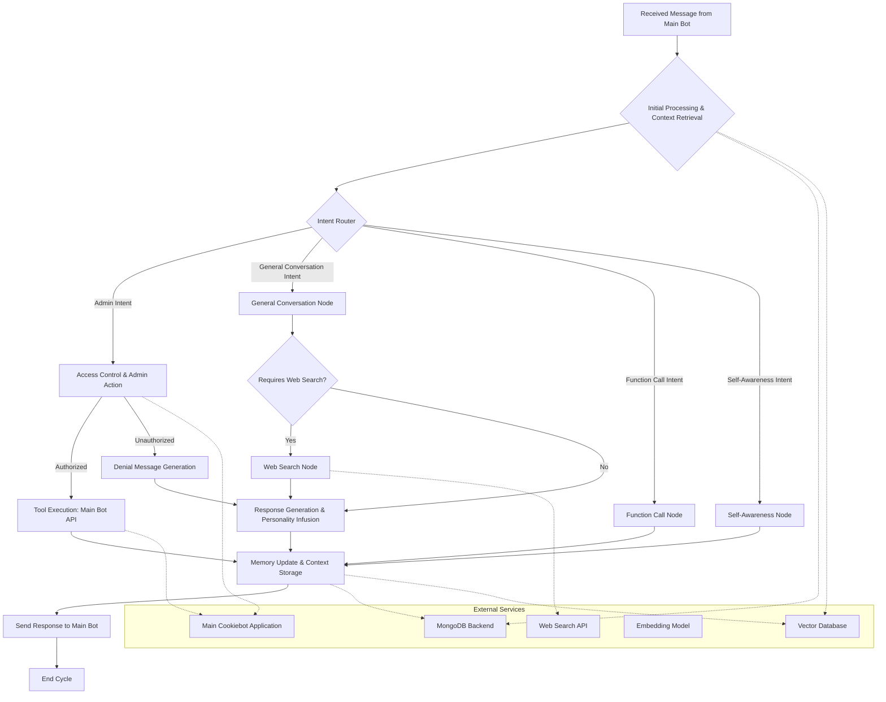

# CookieBaker-AI 2

Langgraph agent application for the Cookiebot project, designed to enhance their conversational abilities, integrate memory and internet search, enable natural language configuration for chat admins, and foster a unique, self-aware personality.

